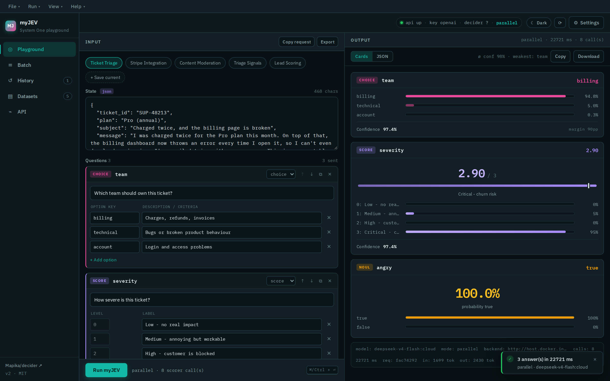
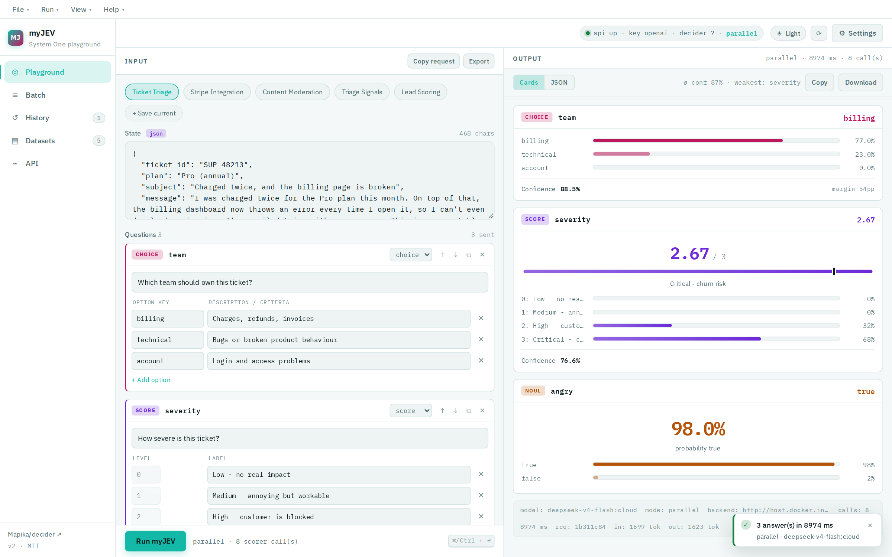
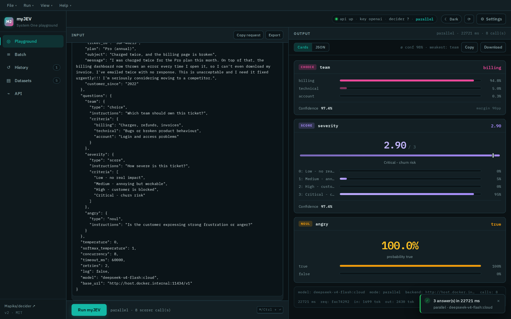
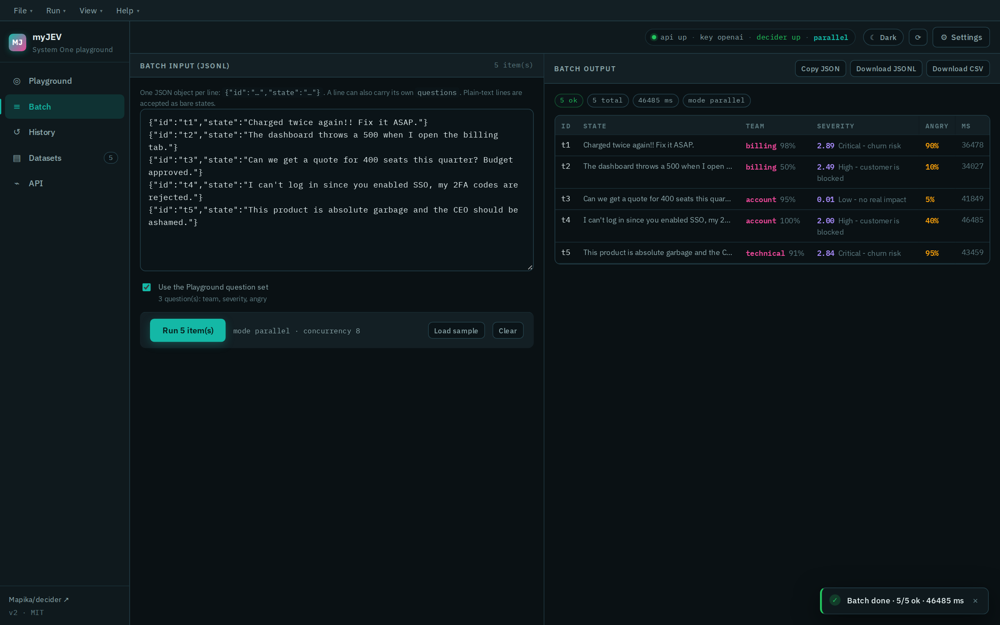
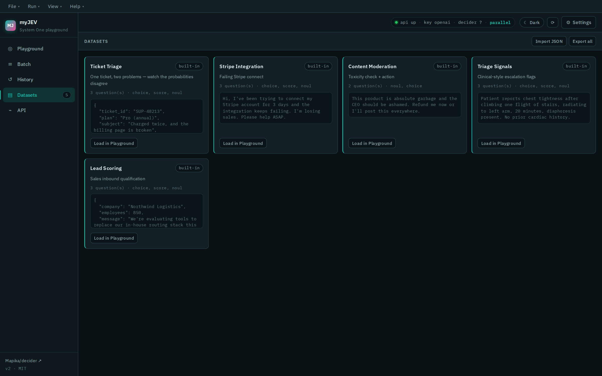
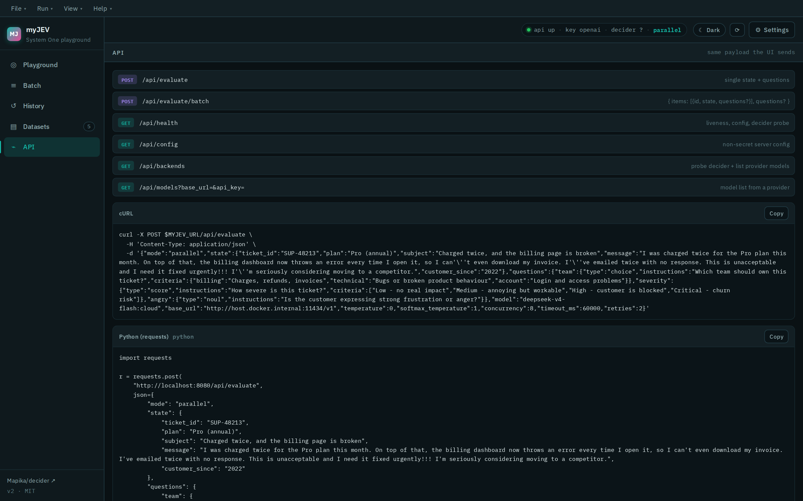
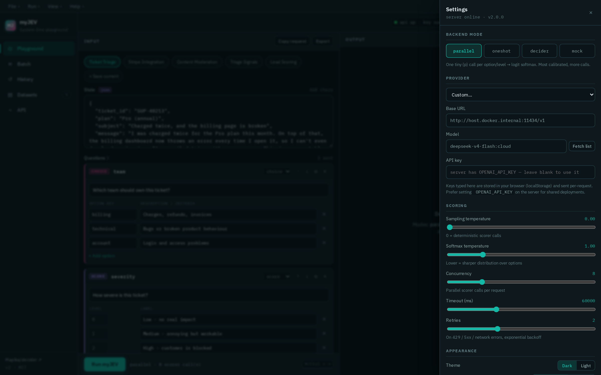
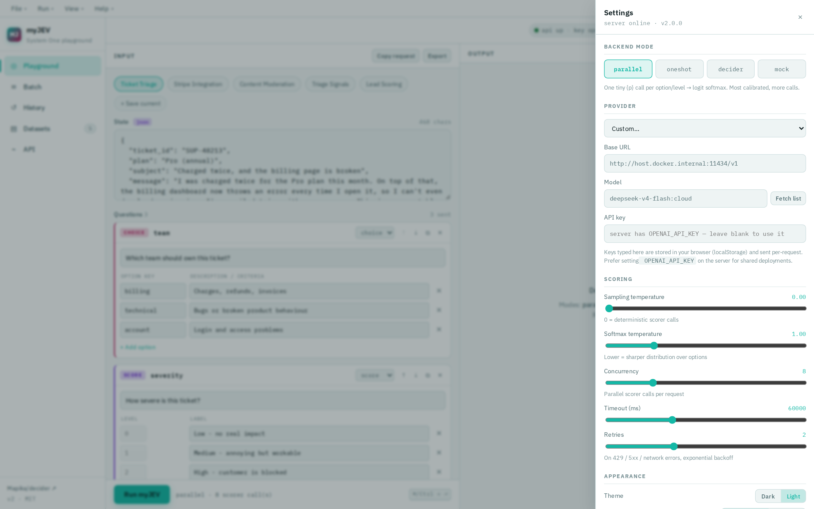
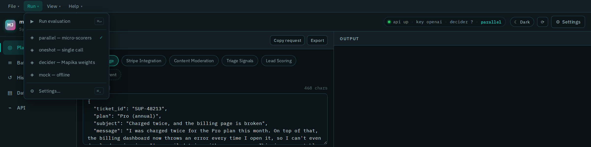

# myJEV

**Open source System One–style decision playground: `state` + typed questions → structured answers.**

Give it any state (a support ticket, a clinical note, a sales email, a JSON blob) plus a set of *typed*
questions, and it returns calibrated, machine-readable answers — not free text.



```jsonc
// POST /api/evaluate
{
  "mode": "parallel",
  "state": "{\"ticket_id\":\"SUP-48213\",\"subject\":\"Charged twice, and the billing page is broken\",\"message\":\"I was charged twice and the billing dashboard throws an error every time I open it.\"}",
  "questions": {
    "team": {
      "type": "choice",
      "instructions": "Which team should own this ticket?",
      "criteria": {
        "billing":   "Charges, refunds, invoices",
        "technical": "Bugs or broken product behaviour",
        "account":   "Login and access problems"
      }
    },
    "severity": { "type": "score", "instructions": "How severe is this ticket?", "criteria": ["Low - no real impact","Medium - annoying but workable","High - customer is blocked","Critical - churn risk"] },
    "angry":    { "type": "noul",  "instructions": "Is the customer expressing strong frustration?" }
  }
}
```

```jsonc
// 200 OK
{
  "model": "gpt-4o-mini",
  "answers": {
    "team":     { "type": "choice", "choice": "billing", "confidence": 0.92,
                  "probabilities": { "billing": 0.85, "technical": 0.14, "account": 0.01 } },
    "severity": { "type": "score", "score": 2.49, "confidence": 0.50,
                  "legend": { "0": "Low - no real impact", "1": "Medium - annoying but workable", "2": "High - customer is blocked", "3": "Critical - churn risk" },
                  "probabilities": { "0": 0, "1": 0.001, "2": 0.507, "3": 0.492 } },
    "angry":    { "type": "noul", "noul": 0.95 }
  },
  "usage": { "input_tokens": 412, "output_tokens": 24 },
  "meta": { "mode": "parallel", "latency_ms": 1843, "parallel_calls": 8, "backend": "openai-compatible" }
}
```

---

## Table of contents

- [Screenshots](#screenshots)
- [Four backends](#four-backends)
- [Question types](#question-types)
- [Quick start](#quick-start)
- [Docker topologies & profiles](#docker-topologies--profiles)
- [The UI](#the-ui)
- [HTTP API](#http-api)
- [Integrate Mapika/decider (RLCD / System One)](#integrate-mapikadecider-rlcd--system-one)
- [Local models (no cloud, no key)](#local-models-no-cloud-no-key)
- [Project layout](#project-layout)
- [Environment variables](#environment-variables)
- [Troubleshooting](#troubleshooting)
- [Tutorial](#tutorial)
- [License](#license)

---

## Screenshots

Screenshots below were captured from a live instance running the `parallel`
backend against a local Ollama model. The offline `mock` backend produces the
same response shape with no key, GPU or network.

### Playground — dark

Input on the left (state + typed questions), calibrated output on the right:
probability bars, a score gauge and a bipolar `noul` meter.


<details>
<summary><b>Playground — light theme</b></summary>



</details>

<details>
<summary><b>The exact request payload</b> — live preview of what will be sent</summary>



</details>

### Batch — score many states at once

Paste JSONL, run it through `/api/evaluate/batch`, export JSONL or CSV:



### Datasets — built-in scenarios

Five ready-made examples plus your own saved, imported and exported sets:



### API — copy-paste recipes

Every endpoint, plus the exact cURL / Python / fetch payload for whatever is on screen:



### Settings

Backend mode, provider presets, model picker, scoring knobs and appearance:



<details>
<summary><b>Settings — light theme</b></summary>



</details>

### Menu bar

`File` / `Run` / `View` / `Help`, with keyboard shortcuts (`⌘`/`Ctrl` + `↵` to run):



---

## Four backends

| Mode | What it is | Needs |
|------|------------|-------|
| **parallel** | LLM micro-scorers — one tiny `{"p": 0..1}` call per option/level, then a logit softmax into a proper distribution | any OpenAI-compatible key |
| **oneshot** | one structured-JSON call for all questions | any OpenAI-compatible key |
| **decider** | [Mapika/decider](https://github.com/Mapika/decider) — real System One weights (calibration-aware RL, v10), TypeSafe wire format `POST /v1/systemone` | a CUDA GPU server |
| **mock** | deterministic offline keyword scorer, same response shape | nothing at all |

`mock` exists so you can run the **entire stack — UI, API, nginx, compose, CI — with no key, no GPU and no
internet**. It's also what the smoke tests and the compose `mock` profile use.

### Why `parallel` is the default

Instead of asking a model to "pick one", `parallel` asks one narrow question per option — *"how well does
this option fit, 0..1?"* — then combines those scores with a temperature-scaled softmax. That yields a **real
probability distribution** over options plus a **confidence** derived from the top probability and the margin
to the runner-up, rather than a single opaque label. Lower `MYJEV_SOFTMAX_TEMPERATURE` sharpens the
distribution; higher flattens it.

---

## Question types

Question types are the TypeSafe Jev set:

| Type | Purpose | Options | Returns |
|------|---------|---------|---------|
| `choice` | pick one of N labelled options | `criteria` map of `option → description` | `choice`, `confidence`, `probabilities` |
| `score` | rated level / severity | `criteria` array of level labels | `score`, `legend`, `confidence`, `probabilities` |
| `noul` | bipolar 0..1 "no/yes" judgment | none | `noul` (0 = no, 1 = yes, 0.5 = unsure) |

`boolean` is accepted as an alias for `noul`.

---

## Quick start

### A. Docker (recommended)

```bash
cp .env.example .env                      # no keys needed for the mock profile
docker compose --profile mock up -d --build
open http://localhost:8080                # nginx UI → node API → mock decider
```

```bash
docker compose up -d --build              # UI + API only (bring your own key in .env)
```

Full Docker guide — topologies, profiles, GPU, TLS, registries, hardening, troubleshooting:
**[`README.DOCKER.md`](README.DOCKER.md)**. Every knob is documented in **[`docs/CONFIGURATION.md`](docs/CONFIGURATION.md)**.

### B. Local (Node ≥ 20.11)

```bash
npm install
cp .env.example .env          # set OPENAI_API_KEY (or leave empty and use mode=mock)
npm run dev                   # tsx watch + Vite HMR → http://localhost:3001
```

Production-ish locally:

```bash
npm run build                 # typecheck → dist/ (SPA) + dist-server/ (bundled API)
npm start                     # node serves both UI and API on :3001
make smoke                    # full offline end-to-end test (45 assertions, no keys)
```

Run the offline mock decider separately (useful with `mode: "decider"`):

```bash
npm run mock                  # wire-format stand-in on :8000
```

### C. Make

```
make help          # every target
make demo          # compose + offline mock      → :8080
make gpu           # compose + Mapika/decider    → :8000 (NVIDIA)
make tls           # compose + Caddy HTTPS       → :8443
make aio           # single all-in-one container → :3001
make smoke         # offline end-to-end test
make health        # probe a running deployment
make ps            # service status + health
make logs          # tail logs
make push REGISTRY=ghcr.io REGISTRY_NS=yourorg TAG=v2.0.0
```

`make up` accepts a `PROFILES` list, e.g. `PROFILES="mock gpu" make up`.

---

## Docker topologies & profiles

Default `docker compose up` starts **`web` + `api`** (nginx SPA with `/api` reverse-proxied to the Node API).
Everything else is opt-in via profiles:

| Profile | Service | What it adds | Default host port |
|---------|---------|--------------|-------------------|
| *(none)* | `web` | nginx static SPA + `/api` proxy | `8080` |
| *(none)* | `api` | Express API (can also serve the SPA itself) | `3001` |
| `mock` | `mock` | offline decider stand-in | `8001` |
| `gpu` | `decider` | real Mapika/decider on CUDA | `8000` |
| `dev` | `dev` | hot-reload full-stack dev image (tsx watch + Vite HMR) | `3001` |
| `dev-api` | `dev-api` | hot-reload API only | `3002` |
| `aio` | `all-in-one` | single container serving UI + API | `3001` |
| `tls` | `caddy` | HTTPS front door (internal CA or your certs) | `8443` / `8081` |
| `ops` | `watchtower` | auto-update images from a registry | — |

All host ports are overridable: `WEB_PORT`, `API_PORT`, `AIO_PORT`, `DEV_PORT`, `DEV_API_PORT`,
`MOCK_PORT`, `DECIDER_PORT`, `TLS_PORT`, `CADDY_HTTP_PORT`.

Images (namespace defaults to `myjev`):

| Image | Dockerfile | Base | Notes |
|-------|-----------|------|-------|
| `myjev/web` | `docker/Dockerfile.web` | `nginx:1.27-alpine` | static SPA + `/api` proxy, unprivileged `:8080`, healthcheck |
| `myjev/api` | `docker/Dockerfile.api` | `node:22-alpine` | bundled Express API (+ can serve the SPA), tini, non-root, JSONL log volume |
| `myjev/dev` | `docker/Dockerfile.dev` | `node:22-bookworm-slim` | hot-reload dev server |
| `myjev/mock-decider` | `docker/mock/Dockerfile` | `node:22-alpine` | offline `POST /v1/systemone` stand-in (zero deps) |
| `myjev/decider` | `docker/decider/Dockerfile` | `nvidia/cuda:12.4-runtime` | real Mapika/decider weights on GPU |

Named volumes are prefixed with `VOLUME_PREFIX` (default `myjev`):
`myjev_logs`, `myjev_node_modules`, `myjev_decider_weights`, `myjev_caddy_data`, `myjev_caddy_config`.

> **Ports already in use?** Compose fails with
> `Bind for 0.0.0.0:<port> failed: port is already allocated` when another stack (or a previous myJEV run)
> holds the port. See [Troubleshooting](#troubleshooting).

---

## The UI

Served by the `web` container on `:8080`, or by the API itself on `:3001`.

* **Playground** — state editor (text or JSON), question builder for all three types, live request preview,
  probability bars, score gauge, confidence + margin, JSON/raw view, copy & download.
* **Batch** — paste JSONL, score hundreds of states through `POST /api/evaluate/batch`, then export JSONL/CSV.
* **History** — the last 50 runs stored in your browser; click one to restore its state, questions *and* config
  (perfect for A/B-ing `parallel` vs `oneshot` vs model X vs model Y).
* **Datasets** — five built-in scenarios — ticket triage, Stripe integration, content moderation,
  medical triage, lead scoring — plus your own saved/imported/exported sets.
* **API** — the exact cURL / Python / fetch payload for whatever is on screen, plus Docker recipes.
* **Settings** — provider presets (OpenAI, Groq, Cerebras, OpenRouter, Together AI, Mistral, DeepSeek,
  Ollama, vLLM / LM Studio, Mock, Custom), model picker with **live model list fetch**, temperature,
  softmax temperature, concurrency, timeout, retries, dark/light theme, density, accent colour, API token,
  audit logging.

Keyboard: `⌘/Ctrl + Enter` runs, `Esc` closes the drawer.

Browser-persisted state uses `myjev-`-prefixed `localStorage` keys
(`myjev-config-v2`, `myjev-history-v2`, `myjev-datasets-v2`).

---

## HTTP API

| Method | Path | Purpose |
|--------|------|---------|
| `POST` | `/api/evaluate` | one state → typed answers |
| `POST` | `/api/evaluate/batch` | `{ items: [{id, state, questions?}], questions?, concurrency? }` |
| `GET` | `/api/health` | liveness + effective config + decider probe (used by Docker/K8s) |
| `GET` | `/api/config` | non-secret server config (the UI reads this on boot) |
| `GET` | `/api/backends` | probe decider + list provider models |
| `GET` | `/api/models?base_url=&api_key=` | model list from any OpenAI-compatible provider |

```bash
# offline, no key
curl -s localhost:8080/api/evaluate -H 'content-type: application/json' -d '{
  "mode": "mock",
  "state": "Charged twice again!!",
  "questions": { "department": { "type": "choice", "instructions": "Which team?",
    "criteria": { "billing": "charges", "technical": "bugs", "other": "else" } } } }'

# with auth (MYJEV_API_TOKEN set on the server)
curl -s localhost:8080/api/evaluate -H "Authorization: Bearer $MYJEV_API_TOKEN" \
     -H 'content-type: application/json' -d @payload.json
```

Per-request overrides (all optional, all validated & clamped server-side):
`mode`, `model`, `base_url`, `api_key`, `decider_url`, `temperature`, `softmax_temperature`,
`concurrency`, `timeout_ms`, `retries`, `max_tokens`, `system_prompt_extra`, `log`.

Set `ALLOW_CLIENT_OVERRIDES=false` to lock the server to its own `.env` and ignore client-supplied
keys/URLs — the right default for a shared deployment.

---

## Integrate Mapika/decider (RLCD / System One)

[decider](https://github.com/Mapika/decider) is an open System One model family (Qwen fine-tunes).
`decider-2b` **v10** includes calibration-aware RL and speaks TypeSafe's wire format: `POST /v1/systemone`.

### 1. Serve the model

```bash
# Docker (NVIDIA Container Toolkit required, ~4 GB VRAM for 2B)
docker compose --profile gpu up -d --build decider

# …or natively — see the decider repo for the serving entrypoint
pip install "git+https://github.com/Mapika/decider#egg=decider[serve]"
```

Smoke test the wire format directly:

```bash
curl -s localhost:8000/v1/systemone -H 'content-type: application/json' -d '{
  "state": "My card was charged twice.",
  "questions": {
    "team":   { "type": "choice", "instructions": "Which team?",
                "criteria": { "billing": "charges, refunds", "technical": "bugs, outages" } },
    "refund": { "type": "noul", "instructions": "Is a refund needed?" }
  }
}'
```

### 2. Point myJEV at it

In `.env`: `DECIDER_BASE_URL=http://decider:8000` (compose) — or set it in UI → Settings → mode `decider`.

```
UI / curl → POST /api/evaluate { mode: "decider", … }
              → myJEV api container
              → POST {DECIDER_BASE_URL}/v1/systemone   (TypeSafe shape)
              → Mapika/decider GPU server
              → typed answers + probabilities
```

### 3. Python, no myJEV

```python
from decider.infer import Decider
d = Decider("Mapika/decider-2b")          # ~4 GB VRAM
print(d.system_one(
    "I was charged twice for order A-104.",
    {
        "department": {"type": "choice", "instructions": "Which team?",
                       "criteria": {"billing": "Charges, refunds", "technical": "Bugs"}},
        "refund": {"type": "noul", "instructions": "Is a refund needed?"},
    },
))
```

---

## Local models (no cloud, no key)

Ollama, vLLM, LM Studio and LiteLLM all expose an OpenAI-compatible `/v1`, so they work with
`parallel`/`oneshot` unchanged — just set the base URL:

```env
OPENAI_BASE_URL=http://host.docker.internal:11434/v1   # Ollama, from inside a container
OPENAI_API_KEY=ollama                                  # any non-empty string
MYJEV_MODEL=qwen2.5:7b
```

> On **Linux**, add this to the `api` service so `host.docker.internal` resolves:
> ```yaml
> extra_hosts: ["host.docker.internal:host-gateway"]
> ```

The UI has presets for all of these (Settings → Provider).

---

## Project layout

```
myJEV/
├── docker-compose.yml              # web + api + profiles: dev, dev-api, aio, mock, gpu, tls, ops
├── docker/
│   ├── Dockerfile.api              # multi-stage node:22-alpine, bundled server, non-root, healthcheck
│   ├── Dockerfile.web              # vite build → nginx:1.27-alpine, non-root, SPA + /api proxy
│   ├── Dockerfile.dev              # hot-reload dev image (tsx watch + Vite HMR)
│   ├── entrypoint.sh               # prints the effective config, then execs
│   ├── nginx/
│   │   ├── nginx.conf              # unprivileged :8080, JSON access logs, gzip
│   │   ├── conf.d/myjev.conf       # SPA fallback, /api proxy via Docker DNS, cache rules
│   │   └── caddy/Caddyfile         # optional TLS front door (internal CA or your certs)
│   ├── mock/                       # offline Mapika/decider stand-in (zero deps)
│   └── decider/Dockerfile          # CUDA image for the real Mapika/decider weights
├── server/
│   ├── index.ts                    # Express: evaluate / batch / health / config / backends / models
│   ├── config.ts                   # every env knob, typed + clamped
│   ├── middleware.ts               # bearer auth + fixed-window rate limiter
│   ├── logger.ts                   # JSONL audit log with rotation
│   ├── health.ts                   # decider probe + provider model listing
│   └── loadEnv.ts                  # dependency-free .env loader
├── src/
│   ├── App.tsx                     # shell: sidebar, header status strip, tabs, settings drawer
│   ├── components/                 # Playground, QuestionEditor, ResultsPanel, BatchPanel,
│   │                               # Panels (History/Datasets/API), SettingsDrawer, Sidebar, Toasts
│   ├── hooks/useAppConfig.ts       # persisted config + server-default merge + health polling
│   ├── lib/                        # evaluate.ts (4 backends), types.ts, api.ts, storage.ts, toast.ts
│   └── styles/app.css              # themeable design tokens (dark/light, density, accent)
├── scripts/
│   ├── build-server.mjs            # esbuild bundle → dist-server/
│   ├── smoke-test.sh               # 45-assertion offline end-to-end test
│   ├── healthcheck.sh              # probe any running deployment
│   ├── docker-build.sh             # buildx multi-arch build/push
│   ├── gen-certs.sh                # self-signed certs for the TLS profile
│   └── healthcheck.mjs             # container HEALTHCHECK probe (no deps)
├── .github/workflows/docker.yml    # CI: typecheck → build → smoke → images → compose e2e
├── docs/
│   ├── CONFIGURATION.md            # every environment variable
│   └── screenshots/                # UI screenshots used in this README
├── Makefile · .env.example · .dockerignore
├── README.DOCKER.md                # the Docker book
└── README.md                       # this file
```

---

## Environment variables

Everything lives in [`.env.example`](.env.example) and is explained in
[`docs/CONFIGURATION.md`](docs/CONFIGURATION.md). The essentials:

### LLM backends (`parallel` / `oneshot`)

| Variable | Default | Notes |
|----------|---------|-------|
| `OPENAI_API_KEY` | — | primary key; also probed, in order: `MYJEV_API_KEY`, `CEREBRAS_API_KEY`, `GROQ_API_KEY`, `PUTER_API_KEY`, `OPENROUTER_API_KEY`, `TOGETHER_API_KEY`, `MISTRAL_API_KEY`, `DEEPSEEK_API_KEY`, `API_KEY` |
| `OPENAI_BASE_URL` | provider default | any OpenAI-compatible endpoint; aliases `MYJEV_BASE_URL`, `LLM_BASE_URL`, `OPENAI_API_BASE` |
| `MYJEV_MODEL` | `gpt-4o-mini` | alias `OPENAI_MODEL` |

### decider backend

| Variable | Default | Notes |
|----------|---------|-------|
| `DECIDER_BASE_URL` | `http://mock:8000` | use `http://decider:8000` with `--profile gpu` |

### Scoring defaults

| Variable | Default | Notes |
|----------|---------|-------|
| `MYJEV_DEFAULT_MODE` | `parallel` | `parallel` \| `oneshot` \| `decider` \| `mock` |
| `MYJEV_TEMPERATURE` | `0` | sampling temperature of the scorer calls (0–2) |
| `MYJEV_SOFTMAX_TEMPERATURE` | `1` | `<1` sharper, `>1` flatter |
| `MYJEV_CONCURRENCY` | `8` | parallel in-flight scorer calls |
| `MYJEV_TIMEOUT_MS` | `60000` | per-request LLM timeout |
| `MYJEV_RETRIES` | `2` | retry count on transient failures |
| `MYJEV_MAX_TOKENS` | `32` | max tokens per scorer call — raise for reasoning models (see [Troubleshooting](#troubleshooting)) |
| `MYJEV_BATCH_MAX` | `200` | max items per `/api/evaluate/batch` |
| `MYJEV_SYSTEM_PROMPT_EXTRA` | — | appended to every system prompt |

### Ops

| Variable | Default | Notes |
|----------|---------|-------|
| `PORT` | `3001` | API listen port |
| `MYJEV_API_TOKEN` | — | if set, clients must send `Authorization: Bearer <token>` |
| `ALLOW_CLIENT_OVERRIDES` | `true` | set `false` to ignore client-supplied keys/URLs |
| `RATE_LIMIT_MAX` | `120` | requests per fixed window per IP |
| `LOG_REQUESTS` | `false` | write the JSONL audit log |
| `MYJEV_VERSION` | `2.0.0` | reported by `/api/health` |

> **Renamed from OpenJev.** This project was previously `OpenJev`; the environment prefix changed from
> `OPENJEV_*` to `MYJEV_*`. If you have an older `.env` or deployment, rename those variables — the old
> names are no longer read and will silently fall back to defaults.

---

## Troubleshooting

**`Bind for 0.0.0.0:<port> failed: port is already allocated`**

Something already owns the port. Find it and free it:

```bash
ss -ltnp | grep -E ':8080|:3001|:8001|:8000'   # who is listening
docker ps --format '{{.Names}}\t{{.Ports}}'    # which container published it
```

If it's a previous stack, tear it down — note that profiled services (`mock`, `gpu`, `tls`, `ops`) are
**not** stopped by a plain `docker compose down`:

```bash
docker compose --profile mock --profile gpu down   # include the profiles you started
```

Alternatively, run myJEV on different ports:

```bash
WEB_PORT=9080 API_PORT=3002 MOCK_PORT=8002 docker compose --profile mock up -d --build
```

**Compose reports a stale network `Resource is still in use`**

A container from a previous run is still attached:

```bash
docker network inspect <name> -f '{{range .Containers}}{{.Name}} {{end}}'
docker rm -f <container> && docker network rm <name>
```

**No API key / an evaluate call fails unexpectedly**

`mock` needs nothing, so prefer it while developing. For real backends set `OPENAI_API_KEY` (or
`MYJEV_API_KEY`) in `.env` and restart the `api` service. A `400`/`502` on `/api/evaluate` usually means a
malformed payload — `choice`/`score` questions require `criteria`, not `options`.

**`parallel` returns identical probabilities for every option (e.g. 0.33 / 0.33 / 0.33)**

The micro-scorer could not read a number out of the model's reply, so it fell back to `0.5` for every
option — which softmaxes to a uniform distribution. The usual cause is `MYJEV_MAX_TOKENS` being too small
for a **reasoning model**: the model spends the whole budget on hidden reasoning and never emits the
`{"p": …}` JSON (`finish_reason: "length"`, empty `content`). Raise it, e.g.

```env
MYJEV_MAX_TOKENS=512     # default is 32, enough only for non-reasoning models
```

**`Connection error.` when pointing at Ollama / vLLM / LM Studio on the host**

`localhost` inside a container is the container itself, not your machine. Use the host gateway name:

```env
OPENAI_BASE_URL=http://host.docker.internal:11434/v1
```

Docker Desktop resolves this automatically. On native Linux/WSL2 Docker the host also resolves it, but
**do not** add an `extra_hosts: ["host.docker.internal:host-gateway"]` override on WSL2 — it replaces the
working resolution with the default-bridge gateway, which cannot reach a host service. Verify from inside
the container with:

```bash
docker exec myjev-api sh -c 'wget -q -O- http://host.docker.internal:11434/'
```

**The UI can't reach the API**

The SPA calls `/api` on its own origin. Behind the `web` container nginx proxies that to the `api` service
over Docker DNS — check `docker compose logs web api`.

**Verify a running deployment end to end**

```bash
make health        # /api/health through nginx and directly
make smoke         # full offline test, no keys needed
```

---

## License

MIT — see [LICENSE.md](LICENSE.md).
